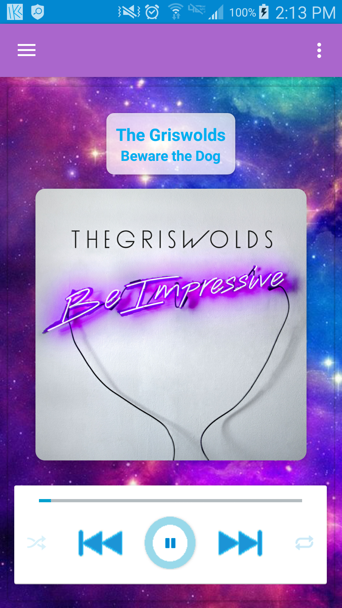

# **Application: KwonPlayer**
## **Developer: Mike Kwon**
## **Contact: Kwondeveloper@gmail.com**

#### Google PlayStore Link

https://play.google.com/store/apps/details?id=kwondeveloper.com.kwonplayer&hl=en

---

#### Player Fragment

-Displays album artwork for currently playing song and media playback status.  Controls allow user to set repeat (All, Single, None) and shuffle states, as well as play / pause / skip / previous navigation.  Seekbar updates every 1000 milliseconds (via a Runnable that recursively calls itself at a 1 second delay via handler) and also allows the user to jump to specific points in the song.  The multi-threading callbacks are all closed in the fragment's lifecycle methods to prevent memory leakage.

---

#### Playlist Fragment

-Playlist fragment displays all the songs currently loaded into the playback queue.  Songs can be dragged and dropped into specific orders, swiped to be removed, and clicked to play (and launch the Player screen).

-All Playlists are stored in a custom SQLite database with all operations launched in separate background threads.  All database threads are synchronized via handler to prevent concurrency issues.  Edits to the Playlist contents and title are automatically saved via the fragment lifecycle methods.  All playlists can be accessed via the floating action button, which launches a dialog containing a list of the Playlists.

---

#### Browse Songs Fragments

-The first browsing fragment is populated when the application boots via Asynchronous thread, which uses the Android ContentProvider to pull any audio files stored on the device.  Another thread simultaneously retrieves any album artwork stored on the device and appends it to the audio file into a custom Media object.  Songs selected here are added to the song queue (playlist) running in a background Service (and displayed on the Playlist Fragment).

-A second browsing fragment contains several nested fragments that allow the user to navigate the phone's media by Album, Artist, Genre, and Android Playlist (playlists built in other apps).  Scrolling between fragments is accomplished by a combination of TabLayout and ViewPager functionality.  RecyclerViews are used to accomplish the different list and grid formats.

---

#### Equalizer Fragment

-Equalizer fragment allows manipulation of audio by applying Equalizer, Virtualizer, Bass Boost, and Reverb effects to the playback AudioSession.  Custom Vertical Seekbar views were used to create intuitive controls for Equalizer bands.

---

#### Main Activity

-A Drawer layout facilitates navigation between fragments without destroying the MainActivity (allowing the activity to act as a channel of communication between fragments & service, as well as a staging area for ephemeral variables tracking playback state and playlist position)
-The ActionBar menu launches dialogs allowing the user to customize the app themes and backgrounds.  Themes consist of color & wallpaper presets, while the background function allows a user to either load pictures from their device or take a new picture to display.

-KwonPlayer is compliant with Marshmallow Persmission requirements (sdk 23+) by prompting the user for permission to access the device's storage and camera at runtime.  These prompts only appear in devices with Marshmallow and up.

---

#### MediaPlayback Service

A background service controls all media playback functionality and playlist sequencing in a seperate thread, coordinates all elements across the app's UI, stores all Playback/Shuffle/Repeat states, manages all AudioFocus requests with other system services, and launches the toolbar & lock-screen notification controls.

---

#### Additional Details

* Broadcast receiver to filter System broadcasts when device state changes (ex: headphone jack is pulled from device) and assign the appropriate playback behavior
* Google Analytics API to track user engagement
* Google Play Services API to enable ad serving

---

#### Features to be included in future updates

* Search toolbar
* Fragment with Photo Gallery integration
* Fragment with Video Playback
* Respond to instructions delivered by headphones with audio playback control hardware included